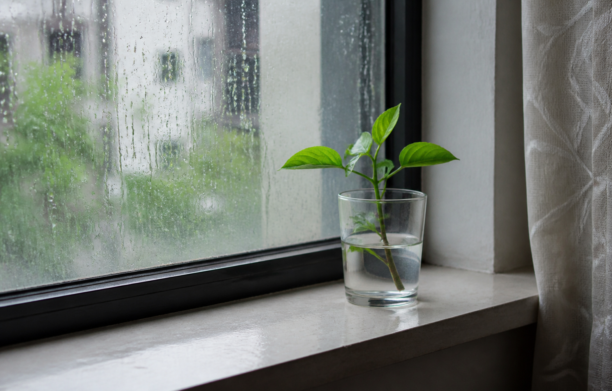
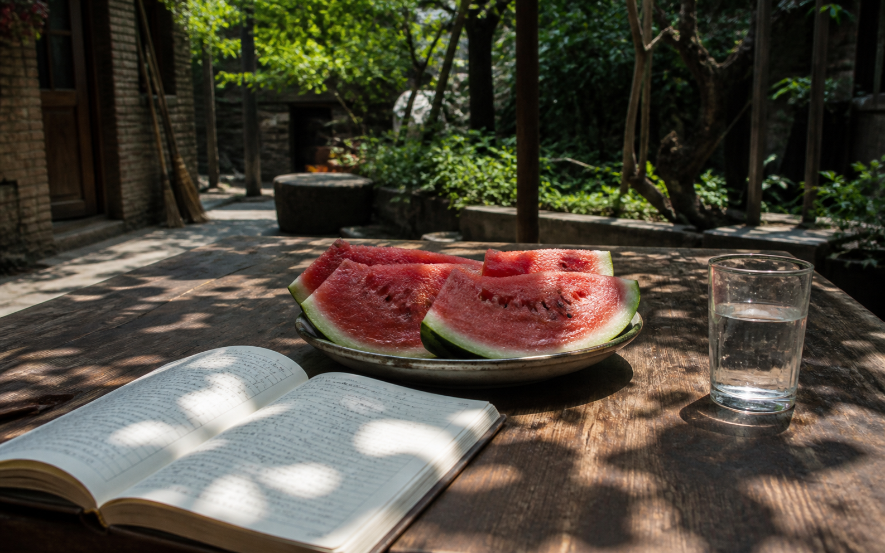
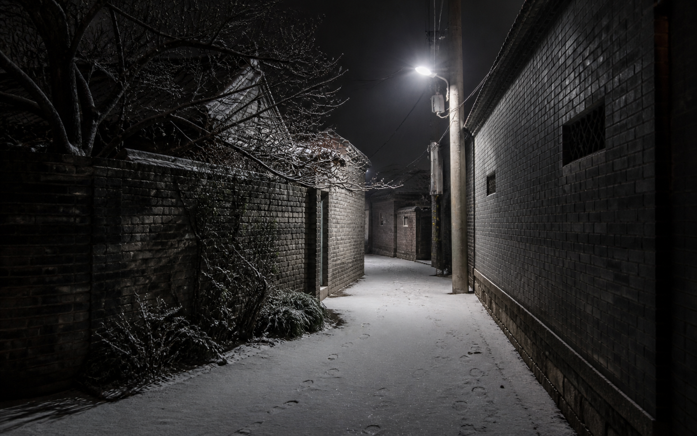

# 四季视觉资产清单与使用边界

> 所有图片均已复制到项目内。生成方式为 Codex 内置 ImageGen；未使用外部 API 或临时网络图库。

## 1. 总览

| 类别 | 数量 | 目录 | 是否可直接进入产品 |
| --- | ---: | --- | --- |
| 方向试纸 | 3 | `probes/` | 否，只用于比较总体方向 |
| 单页 UI 参考 | 12 | `screens/` | 否，只用于布局、比例、光线和气质 |
| 四季本地样片 | 4 | `assets/seasonal-samples/` | 可以，需在实现时完成压缩、裁切与许可说明 |

图片事实优先级低于书面规范。任何图中文字、日期、统计、路径、设置项或功能都不得未经核对直接实现。

## 2. 方向试纸

| 文件 | 内容 | 主要用途 |
| --- | --- | --- |
| `probes/direction-a-archive.png` | 典藏四页四宫格，1672×941 | 确认四册档案的共同 DNA 与季节区分 |
| `probes/direction-b-light.png` | 光影四页四宫格，1672×941 | 确认晨光、正午、长影、夜读的明暗关系 |
| `probes/direction-c-instrument.png` | 刻度四页四宫格，1672×941 | 确认表盘、胶片尺、校准线和保存登记的几何语言 |

## 3. 典藏单页参考

| 文件 | 页面 | 可借用 | 禁止照抄 |
| --- | --- | --- | --- |
| `screens/archive/spring-now.png` | 春·此刻 | 三列观察档案、雨后照片、底部记忆与测量区 | 天气、坐标、海拔等当前不存在的数据 |
| `screens/archive/summer-timeline.png` | 夏·时光 | 年份轴、月份索引、接触印照片带、细红定位线 | 图中任意示例统计与照片内容 |
| `screens/archive/autumn-degrees.png` | 秋·几度 | 余下主记录、长基线、右侧窄索引、列表节奏 | 节气功能、农历数据，除非未来有真实需求与数据源 |
| `screens/archive/winter-settings.png` | 冬·我的 | 深色身份区、四季装帧预览、纵向叙事单选 | 错误标签、虚构统计与任何书本拟物细节 |

生成提示核心：高保真 Windows 桌面 UI；当代个人档案；中性纸面、深墨、朱红方印；春观察、夏索引、秋年鉴、冬保存；禁止米黄旧纸、卡片网格、季节贴纸和 KPI。

## 4. 光影单页参考

| 文件 | 页面 | 可借用 | 禁止照抄 |
| --- | --- | --- | --- |
| `screens/light/spring-now.png` | 春·此刻 | 35:65 文字／照片分屏、底部摘要带、晨光留白 | 把照片当整页背景、图中硬编码日期 |
| `screens/light/summer-timeline.png` | 夏·时光 | 照片带与信息行交替、正午高光和深阴影 | 照片瀑布流、图库化内容、图中文字 |
| `screens/light/autumn-degrees.png` | 秋·几度 | 28:48:24 三列、长影照片、右侧人生轴 | 把寿命当系统预测、硬编码年龄或年份 |
| `screens/light/winter-settings.png` | 冬·我的 | 台灯身份区、下方实色设置面、稳定选择器位置 | “日光／柔光／夜间”等生成标签；真实值必须是浅色／深色／高对比 |

生成提示核心：四种自然光；照片决定季节情绪但不覆盖功能文字；春晨雨、夏正午、秋长影、冬夜读；禁止渐变、玻璃、海报式文字和图库感。

## 5. 刻度单页参考

| 文件 | 页面 | 可借用 | 禁止照抄 |
| --- | --- | --- | --- |
| `screens/instrument/spring-now.png` | 春·此刻 | 单一主表盘、右侧观察照片、底部工具条 | 天气、相机参数、坐标及过密刻度 |
| `screens/instrument/summer-timeline.png` | 夏·时光 | 双胶片带、年份尺、当前位置线、下方详情 | 做成视频编辑器、增加播放控制 |
| `screens/instrument/autumn-degrees.png` | 秋·几度 | 单一校准图、左右事实列、底部阶段线 | 医学推断、东方历法校准、实时秒表和多仪表盘 |
| `screens/instrument/winter-settings.png` | 冬·我的 | 三列保存登记、下方稳定叙事选择器 | 光盘归档、校验系统、虚构目录、锁与保险库隐喻 |

生成提示核心：四种时间仪器；表盘、胶片尺、校准台、保存登记；精确但非科幻；每个数字必须有人话解释；禁止 KPI、HUD、速度表、保险库和装饰网格。

## 6. 可直接使用的四季本地样片

### 春

- 文件：`assets/seasonal-samples/spring-rain-window.png`
- 场景：雨后住宅窗边，一枝新绿插在普通水杯中。
- 建议裁切：此刻页 4:3；光影页 16:10；设置预览 1:2 竖条。
- alt 建议：`雨后窗边玻璃杯中的一枝新绿`。

生成提示：真实中国日常纪录摄影，雨后冷中性晨光，湿玻璃与普通窗台；避免花朵、粉彩和园艺广告。

### 夏

- 文件：`assets/seasonal-samples/summer-courtyard-table.png`
- 场景：正午树荫下的旧木桌、西瓜、水杯与翻开的手写本。
- 建议裁切：时光照片带 16:5；光影大图 16:9；设置预览 1:2 竖条。
- alt 建议：`夏日树荫下放着西瓜、水杯和手写本的木桌`。

生成提示：硬正午光与真实深阴影，叶绿与西瓜红，非商业食物摄影；避免度假、摆拍和清晰可读文字。

### 秋

- 文件：`assets/seasonal-samples/autumn-riverside-shadow.png`
- 场景：城市河边傍晚步道，一道从画外延伸的长影。
- 建议裁切：几度主图 3:4 或 4:3；横向时间场 16:7；设置预览 1:2 竖条。
- alt 建议：`傍晚城市河边步道上的一道长影`。

生成提示：普通中国城市河岸、低角度日光、真实混凝土与远景雾；避免落叶堆、旅游明信片和橙色滤镜。

### 冬

- 文件：`assets/seasonal-samples/winter-night-lane.png`
- 场景：轻雪后的住宅巷道，一盏中性白路灯和少量脚印。
- 建议裁切：我的身份区 16:5；档案封面 3:4；设置预览 1:2 竖条。
- alt 建议：`轻雪后被一盏路灯照亮的安静住宅巷道`。

生成提示：石墨夜色、中性白灯光、银灰地面、安静但安全；避免圣诞、蓝紫色偏、恐怖氛围和大雪。

## 7. 样片进入产品前的处理

1. 保留本目录 PNG 原图作为设计母版，不直接覆盖。
2. 为应用生成 WebP 或 AVIF 衍生版本；Windows WebView 兼容性验证后再选格式。
3. 主照片建议长边 1920px，质量以肉眼无明显色带为准；缩略图另生成 480px 长边版本。
4. 裁切时保留关键主体安全区：春的水杯、夏的西瓜与手写本、秋的长影、冬的路灯与巷道。
5. 所有衍生文件记录来源为“项目内 AI 生成样片”，不得伪装成用户照片。
6. 用户有真实照片时，真实照片优先；样片只用于首次体验、无照片状态与主题预览。
7. 高对比模式下不把样片作为大背景，可缩为带 2px 边界的内容图或隐藏。

## 8. 图片生成共同约束

- UI 图：真实、可交付的 Windows 桌面产品界面，不是概念艺术。
- 摄影图：自然、克制的中国日常纪录摄影，不是商业图库。
- 无品牌、无水印、无蓝紫渐变、无玻璃拟态、无大阴影。
- 不使用花、太阳、落叶、雪花图标表达季节。
- 不增加账号、云端、天气、地图、AI、社交、医学预测或复杂归档硬件。
