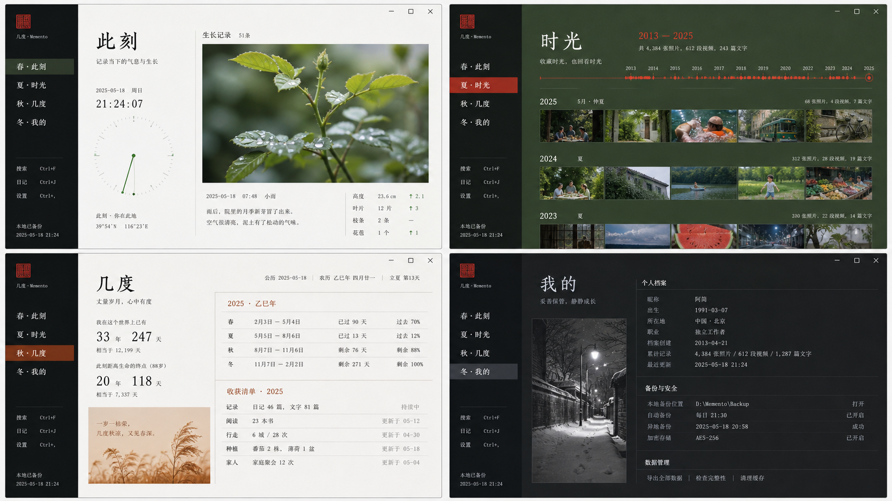
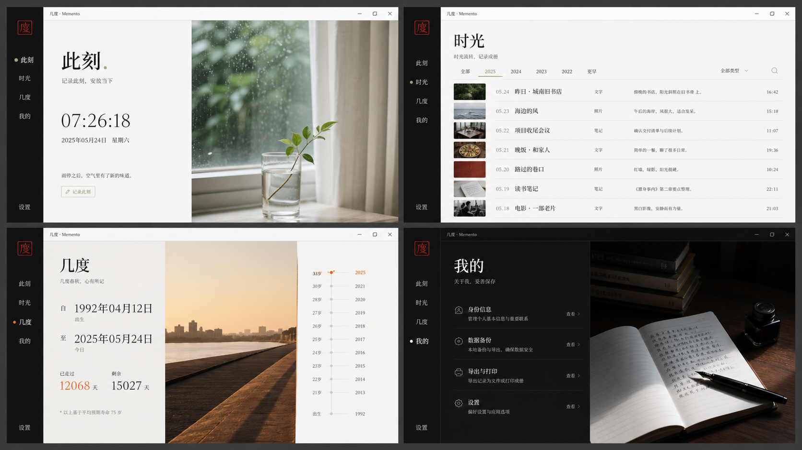
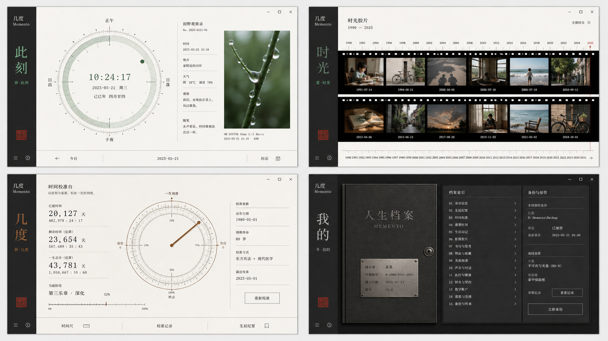

# 几度 · Memento 四季视觉叙事设计文稿

> 状态：设计确认稿（待用户最终确认后进入实现）  
> 日期：2026-08-22  
> 适用范围：Windows PC，主设计尺寸 1440×900，验收宽度 1280–1920px

## 1. 设计结论

几度采用两层彼此独立的视觉系统：

1. **四季章节**固定对应四个主页面，用来表达人生时间的不同状态。
2. **视觉叙事**提供三种可切换的观看方式，用来表达用户偏好的阅读气质。

固定映射如下：

| 页面 | 季节 | 时间含义 | 用户进入页面时应感受到 |
| --- | --- | --- | --- |
| 此刻 | 春 | 正在发生、正在生长 | 清醒、呼吸、愿意记录今天 |
| 时光 | 夏 | 生活展开、记忆丰盛 | 明亮、充实、愿意向后翻阅 |
| 几度 | 秋 | 成熟、衡量、看见流逝 | 平静、准确、接受已经与余下 |
| 我的 | 冬 | 收藏、静默、妥善保存 | 安心、私密、被保护 |

三种视觉叙事如下：

| 设置名称 | 内部建议值 | 核心隐喻 | 默认状态 |
| --- | --- | --- | --- |
| 典藏 | `archive` | 四册个人档案 | **默认** |
| 光影 | `light` | 四种自然光 | 可选 |
| 刻度 | `instrument` | 四种时间仪器 | 可选 |

一句话设计概念：

> 同一座人生档案馆，四个具有不同气候、光线与时间密度的阅览室；用户可以选择以典藏、光影或刻度的方式阅读它。

## 2. 为什么不是十二套独立界面

四个页面乘以三种叙事，视觉上确实形成十二种画面，但产品结构不能变成十二套实现。每个页面的任务、内容顺序、主要操作和键盘路径必须固定；变化只发生在内容的编排语法、摄影比例、季节色权重和时间图形上。

必须保持不变的部分：

- 左侧 104px 主导航、Tab 顺序和名称。
- 页面标题、主要动作位置与记录入口。
- 「几度」中的经年、余下、刻度三类数据含义。
- 抽屉、对话框、表单、按钮、焦点样式和错误反馈。
- 数据读写、备份、导入、恢复与高风险操作流程。
- 当前页、筛选条件、滚动位置和未完成输入。

允许随视觉叙事变化的部分：

- 主内容区的列宽、留白节奏与视觉重心。
- 照片是标本、光源还是记录证据。
- 时间图形使用档案索引、自然光轴或仪器刻度。
- 季节色在页面中的面积和明暗关系。
- 标题与数据之间的排版张力。

这样既保留三套完整气质，也避免用户每切换一次就重新学习产品。

## 3. 三个视觉方向

### 3.1 典藏 · 四册个人档案（默认）

这是产品的默认叙事，也是最接近几度“Personal Archive”定位的一套。页面像四册不同用途的档案，但装订方式、编号系统、纸张边界和导航完全一致。

- 摄影角色：记录证据、标本和索引缩略图。
- 排版角色：中文衬线承担情感，等宽数字承担时间证据。
- 页面密度：中等；依靠细线、编号、照片和留白组织信息。
- 性格：克制、可信、长久，不追求即时惊艳。

### 3.2 光影 · 四种自然光

这套叙事把照片和真实光线放到更高位置。季节不是贴在界面上的颜色，而是窗边晨光、正午硬光、傍晚长影和冬夜台灯改变内容的阅读方式。

- 摄影角色：页面的主要情绪来源，面积为三套中最大。
- 排版角色：更少的框线、更大的空白、更明确的明暗块面。
- 页面密度：春冬较疏、夏秋较密。
- 性格：私人、感性、接近生活摄影集。

### 3.3 刻度 · 四种时间仪器

这套叙事强调时间可被观察，但不能变成效率仪表盘或科幻控制台。仪器只是让抽象时间变得可见，不能抢走记录本身。

- 摄影角色：观察样本和时间证据，面积最小。
- 排版角色：等宽数字、基准线、刻度和精确对齐更突出。
- 页面密度：三套中最高，但仍以阅读为主。
- 性格：冷静、专注、略带私人观测站气质。
- 明确修正：冬季「我的」使用“保存登记册”，不使用保险库门、机械锁等过度拟物元素。

视觉试纸只用于表达气质、明暗和布局关系，其中的临时文字、数据和控件不属于最终产品规范。

## 4. 十二个页面的设计定义

### 4.1 典藏叙事

#### 春 · 此刻：生长观察页

- 顶部仍显示今日日期、页面名和记录按钮。
- 主体采用约 54:46 的双栏：左侧为正在走动的时间与年度位置，右侧为一张“今日标本”照片。
- 时间轨迹采用细线与一个正在移动的点，不做 KPI 圆环。
- 下方保留一段置顶记忆和经年／余下摘要，表现为档案条和测量行，不堆叠卡片。
- 无用户照片时，右栏退化为中性观察纸：日期、天气无关的光线描述、空白照片框和“记录此刻”提示，不联网取图。

#### 夏 · 时光：丰盛索引页

- 以年份横轴和月份档案为主，照片形成接触印样式的连续带。
- 当前年份最明亮，历史年份逐渐降低色彩面积，但文字对比不降低。
- 列表保持可扫描：日期、标题、类型、摘要和照片数量位置稳定。
- 夏季不是满屏绿色，而是由用户照片、深叶色索引面和朱红定位线共同形成。

#### 秋 · 几度：时间年鉴页

- 经年、余下、刻度仍是三个标准 Tab，不改变信息架构。
- 主视图像一本精确年鉴：数据列、日期线、阶段线和文字解释共同出现。
- 「余下」强调具体还会遇见哪些日子，而不是只显示一个大数字。
- 大数字只在当前记录中出现一次，旁边必须有起止日期与自然语言解释。

#### 冬 · 我的：保存目录页

- 上部是个人档案封面，展示本地身份、记录数量和最后更新。
- 下部是长页设置索引；数据安全优先于装饰。
- 备份区像保存登记，不像保险柜；危险操作与日常导出明显分离。
- 冬季可使用一张低饱和夜间照片，但不得压低表单和说明文字的可读性。

### 4.2 光影叙事

#### 春 · 此刻：雨后晨光

- 使用大面积窗边自然光照片，时间读数落在安静的中性留白中。
- 主体节奏疏，减少可见框线；用光线边界而非卡片边界分区。
- 记录按钮保持标准控件外观，不能浮在照片上失去对比。

#### 夏 · 时光：正午记忆带

- 时间轴变为横向照片带与纵向文字索引的组合。
- 画面最饱满，但页面顶部和筛选区仍保持呼吸空间。
- 高光、阴影与色彩来自真实照片；不增加人工渐变。

#### 秋 · 几度：傍晚长影

- 以一条贯穿页面的水平时间线建立秩序，数据沿线分布。
- 柿红只用于当前位置、选中状态和主要动作。
- 照片采用低角度自然光，不使用模板化金黄落叶图。

#### 冬 · 我的：夜读台灯

- 页面可整体进入深色阅读室，但设置表单仍使用清楚的实色表面。
- 照片只占个人档案区，不进入备份密码、导入和危险操作区域。
- 冬季的安静来自暗部与留白，不来自模糊、玻璃或低对比文字。

### 4.3 刻度叙事

#### 春 · 此刻：生命时钟

- 主体是一枚可读的季节时间盘，展示当前时间、今日位置和年度进度。
- 圆形只用于时间盘本身，不把其他内容也做成仪表。
- 旁边是观察记录和一张近距离生活照片，抵消仪器的冷感。

#### 夏 · 时光：记忆胶片尺

- 照片沿时间尺展开；键盘与滚轮均可浏览，焦点位置清楚。
- 时间尺上只显示能帮助定位的年份和重要记录，避免形成装饰刻度墙。
- 无照片记录仍以标题和日期占据等价位置，不出现破碎空洞。

#### 秋 · 几度：时间校准台

- 经年使用累计刻度，余下使用未来日历线，刻度使用阶段区间；三者各有明确语法。
- 可存在一枚主测量图，但列表与编辑操作仍是标准产品控件。
- 禁止仪表盘式四宫格数字、速度表视觉和无意义实时跳动。

#### 冬 · 我的：保存登记册

- 个人信息、外观、备份、关于形成一份编号目录。
- 备份状态使用时间戳、校验状态和清晰动作表达，不使用保险库门或机械锁视觉。
- 当前主题选择器必须在这套高密度界面里仍然一眼可找到。

## 5. 设置页：视觉叙事切换器

现有「03 / 显示与主题」建议更名为「03 / 外观与阅读」，拆成三个互不混淆的维度：

1. **视觉叙事**：典藏 / 光影 / 刻度。
2. **阅读光线**：浅色 / 深色 / 高对比。
3. **阅读习惯**：舒适 / 紧凑，以及数字是否使用千位分组。

### 5.1 空间结构

- 左侧约 64% 是一块“装帧样本”，同时显示春夏秋冬四条窄幅页面缩略图。
- 右侧约 36% 是三个纵向单选项，以分隔线组织，不做三张同尺寸卡片。
- 每个选项包含名称、一句说明和当前状态；缩略图只是辅助，文字标签才是选择依据。
- 设置区在三种叙事下保持同一位置和尺寸，避免用户切换后找不到返回路径。

建议文案：

- **典藏**：像翻阅四册仍在续写的个人档案。
- **光影**：让四种自然光照进你的时间记录。
- **刻度**：以更精确的尺度观察已经与余下。

### 5.2 交互

- 单击或按空格立即应用，无“保存”按钮；偏好仅保存在本机。
- 键盘上下键在三个选项间移动，焦点环始终可见。
- 鼠标悬停或键盘聚焦可更新左侧预览，但只有确认选择后才写入偏好。
- 应用后保留当前页面、滚动位置、筛选、打开的几度子 Tab 和未提交表单。
- 页面结构变化采用 180–220ms 淡出／淡入；禁止大范围滑动和弹跳。
- `prefers-reduced-motion: reduce` 下立即切换，只保留颜色状态变化。
- 高对比模式优先级最高：它可以减少或移除装饰照片与季节底色，但不改变用户选择的叙事名称。

### 5.3 状态

- 默认：未聚焦，显示当前选项。
- 悬停：只增强边界和标题，不移动容器。
- 键盘焦点：2px 清晰焦点环，和背景至少 3:1。
- 已选：单选标记、文字和预览同步，不能只靠颜色表示。
- 正在应用：不显示全页加载；预览区短暂淡化，控件保持可见。
- 存储失败：原选择保持有效，就地提示“外观偏好未能保存，你的记录不受影响”。

## 6. 共同视觉系统

### 6.1 固定品牌元素

- 侧栏：近黑绿，104px，四季不换位置。
- 标记：朱红方印，保持方形，不随主题变成季节图标。
- 情感文字：`Noto Serif SC` / `Songti SC` 回退。
- 控件与正文：`Noto Sans SC` / `Microsoft YaHei` 回退。
- 日期和测量：`Cascadia Mono` / `Segoe UI Mono` 回退。
- 组件圆角：0–4px；照片可为 0–2px。
- 分隔：1px 细线；重要时间基线可使用 2px。

### 6.2 颜色策略

背景继续采用中性白、浅灰和近黑，不使用模板化米色。朱红是跨主题的品牌动作色；季节色只承担页面身份、当前位置、照片陪衬和少量时间图形。

| 角色 | 建议色 | 用途 |
| --- | --- | --- |
| 中性画布 | `#E1E5E1` | 应用背景 |
| 中性纸面 | `#F7F7F4` | 主要阅读面，避免米黄纸张感 |
| 深墨 | `#17251F` | 正文与深色结构 |
| 导航黑 | `#0C1513` | 左侧导航与冬季深色基底 |
| 品牌朱红 | `#D45138` | 主要动作、当前状态、方印 |
| 春芽绿 | `#6F8959` | 春季位置与生长线 |
| 夏叶绿 | `#294C37` | 夏季索引面与照片陪衬 |
| 秋柿红 | `#B55735` | 秋季测量位置与选中状态 |
| 冬银灰 | `#AEB9B5` | 冬季次级刻度与保存状态 |

- 正文对比必须达到 WCAG AA 4.5:1。
- 季节色若不能达到正文对比，只能用于大文字、图形、边界或背景陪衬。
- 高对比模式统一回到黑、白和深红语义，不要求保留季节色。
- 不使用蓝紫渐变、装饰渐变、玻璃模糊和大面积柔阴影。

### 6.3 摄影原则

照片优先级：用户自己的记录照片 > 随安装包提供的本地季节样片 > 无图排版状态。应用运行时不联网拉取图片。

- 春：雨后窗边、湿润枝条、刚开始的日常；避免樱花旅游照。
- 夏：真实正午、树荫、家人与行走；避免纯风景图库感。
- 秋：低角度光、成熟物件、回看中的生活；避免满屏落叶。
- 冬：夜路、室内灯、保存中的物件；避免圣诞与雪花符号。
- 不在照片上覆盖长正文；必要覆盖必须使用实色信息条，而不是玻璃层。
- 用户照片方向、数量或加载失败时，布局不能塌陷。

## 7. 内容与语气

季节应被用户感到，而不是被界面反复说出。页面只在导航或页眉中出现一次“春 / 夏 / 秋 / 冬”辅助标识，不增加诗句轮播和每日鸡汤。

建议页眉文案：

- 春 · 此刻：**今天，也在时间里。**
- 夏 · 时光：**生活留下来的，不止日期。**
- 秋 · 几度：**已经走了多少，还能看见多少。**
- 冬 · 我的：**你的时间册，安静地保存在这里。**

空状态必须教会动作：

- 此刻无记录：**从今天留下一件小事。**
- 时光无内容：**第一条记录，会成为时间轴的起点。**
- 几度无计数：**为一段已经开始或仍在等待的时间命名。**
- 我的无照片：**照片不是必需的；文字和日期也能构成你的档案。**

## 8. 边界、异常与可访问性

- 1280px：保持侧栏，内容降为更紧凑的双栏或单主栏，不隐藏核心操作。
- 1920px：限制阅读宽度，扩大外侧留白，不无限拉长表格和正文。
- 照片为 0、1、20、500 张时都能浏览；大量照片使用虚拟化或延迟解码，不在本设计中更改数据模型。
- 主题切换期间不得丢失输入、关闭抽屉或重置筛选。
- 所有图片有内容型替代文本；纯气氛样片标记为装饰。
- 所有控件具备默认、悬停、焦点、按下、禁用、加载和错误状态。
- 不通过季节色单独传达选中、错误、成功或危险。
- 深色模式不是简单反相；照片亮度不得导致文字或焦点丢失。
- 高对比模式不展示低对比季节底色，照片可降为小缩略图或隐藏。

## 9. 实现交接约束

建议用三个正交属性表达状态，而不是复制页面：

- `data-page="now|timeline|degrees|settings"`
- `data-visual-story="archive|light|instrument"`
- `data-theme="light|dark|high-contrast"`

数据偏好新增一个可选字段即可：

- `visualNarrative?: 'archive' | 'light' | 'instrument'`
- 旧数据缺失时默认迁移为 `archive`。

实现时优先提取“语义槽位”：页眉、主时间图、主照片、索引、摘要、主要动作。三种叙事重新编排这些槽位，不复制记录、备份和表单逻辑。

推荐实施顺序：

1. 建立视觉叙事字段、根属性、共享季节 token 和设置切换器。
2. 完成默认「典藏」四页，并验证现有功能无回归。
3. 完成「光影」四页及无照片降级。
4. 完成「刻度」四页，重点压制仪表盘化倾向。
5. 补齐浅色、深色、高对比、紧凑密度和 reduced motion。
6. 在 1280、1440、1920 三种宽度完成视觉、键盘与数据安全审阅。

实现阶段建议重点参考 Impeccable 的 `layout`、`typeset`、`colorize`、`animate` 与 `harden` 规范。

## 10. 验收标准

### 产品

- 四页不用查看标签也能凭气候、光线和节奏辨认春夏秋冬。
- 三种视觉叙事明显不同，但任何功能最多一次寻找即可定位。
- 默认「典藏」符合 Personal Archive / Quiet / Emotional Minimalism。
- 主题切换不改变任何记录内容和备份内容。

### 视觉

- 不出现蓝紫渐变、玻璃拟态、Bento Dashboard、大阴影、过度圆角和季节贴纸。
- 不依赖花、太阳、落叶、雪花图标表达四季。
- 每页最多一处主视觉焦点，照片、数字与标题不互相争抢。
- 正文与控件达到 WCAG AA；高对比模式不保留不可读的审美元素。

### 交互

- 视觉叙事可用鼠标和键盘切换，选择即时反馈且持久保存。
- 切换后当前页面、滚动、筛选、子 Tab 与表单输入保持不变。
- reduced motion 下无位移式主题动画。
- 设置页在三种叙事中结构稳定，用户随时能切回。

### 工程与数据安全

- 不复制业务数据逻辑，不为每个视觉叙事建立独立状态树。
- 旧备份可正常导入，新字段缺失时安全回退到「典藏」。
- 用户照片错误、缺失或数量很大时不影响记录访问。
- 发布前完成产品、视觉、数据安全与工程审阅，并记录到 `docs/reviews/`。

## 11. 本轮明确不做

- 不根据真实月份自动切换整个应用主题。
- 不允许用户为单个 Tab 分别选择不同视觉叙事。
- 不增加在线主题商店、主题下载和账号同步。
- 不在本轮引入天气、地图、AI 生成日记或社交功能。
- 不为了季节感改变数据含义、备份格式或记录流程。
