# 四季视觉叙事 · 精确实施规范

> 本文是后续设计与前端实现的主执行文件。参考图提供感性方向，本文提供确定规则。两者冲突时，以本文为准。

## 1. 目标场景

用户在 Windows 桌面电脑前整理自己的人生记录，可能是白天工作间隙，也可能是夜晚独处。界面要让用户感到时间正在被看见和妥善保存，而不是催促其完成任务。

默认场景句：

> 一个人在安静的桌面前翻阅仍在续写的人生档案；左侧是始终可靠的目录，右侧随着春夏秋冬进入四间不同气候的阅览室。

## 2. 页面坐标与全局几何

### 2.1 1440×900 主画布

| 区域 | 精确值 | 说明 |
| --- | ---: | --- |
| 应用最小宽度 | 1280px | 不制作移动布局 |
| 左侧导航 | 104px | 三种叙事和所有页面固定 |
| 主内容可用宽度 | 1336px | 1440 - 104 |
| 内容最大宽度 | 1180px | 1920px 时也不继续拉宽 |
| 1440 内容左右留白 | 78px | 位于主内容列内部 |
| 页面顶部留白 | 42–46px | 设置页可为 34px |
| 页面底部安全区 | 72px | 长页最后一项之后 |
| 页眉占高 | 84–96px | 含标题、说明和主动作 |
| 基础栅格 | 4px | 所有尺寸尽量为 4 的倍数 |
| 常用间距 | 8 / 12 / 16 / 24 / 32 / 48 / 64px | 禁止随意制造 17、29、37px 等孤立值 |

### 2.2 内容宽度计算

- 1280px：主内容列宽 1176px；内容宽约 1106px，左右约 35px。
- 1440px：主内容列宽 1336px；内容固定 1180px，左右 78px。
- 1920px：主内容列宽 1816px；内容固定 1180px，左右 318px。
- 不允许照片、时间轴或设置区在 1920px 无限伸展；额外宽度全部转化为外侧留白。

### 2.3 左侧导航

- 宽 104px，高度等于视口，深色实底；不得随主题变浅。
- 品牌方印 42×42px，距顶部 20px，使用朱红；不显示季节图标。
- 四个主导航项从顶部约 150px 开始，每项 64px 高，间距 4–6px。
- 主标签为此刻、时光、几度、我的；季节可作为 9px 辅助字出现一次。
- 激活状态同时使用：3px 位置标记、文字亮度变化、季节辅助字；不能只靠颜色。
- 底部依次放置记录入口、个人或设置入口与本地保存状态；不得增加图片中虚构的快捷键功能，除非当前产品已经存在。
- 焦点环向内绘制，避免被侧栏边界裁切。

## 3. 排版系统

### 3.1 字体角色

| 角色 | 字体栈 | 用途 |
| --- | --- | --- |
| 情感衬线 | `Noto Serif SC`, `Songti SC`, serif | 页面标题、记录标题、重要自然语言 |
| 产品无衬线 | `Noto Sans SC`, `Microsoft YaHei`, sans-serif | 正文、控件、说明、错误信息 |
| 时间等宽 | `Cascadia Mono`, `Segoe UI Mono`, monospace | 日期、时间、编号、刻度、计数 |

不为三种叙事更换字体家族；差异来自字号、密度与占比。按钮、表单、Tab 和导航禁止使用展示型衬线。

### 3.2 1440px 字号表

| Token | 字号 / 行高 | 字重 | 用途 |
| --- | --- | --- | --- |
| `display-page` | 52 / 58px | 500 | 页面主标题；1280 时降为 44px |
| `display-time` | 68 / 68px | 400 | 此刻主时间；一页只出现一次 |
| `display-number` | 44 / 48px | 400 | 经年、余下、刻度主值 |
| `title-section` | 26 / 34px | 500 | 大区块标题 |
| `title-record` | 18 / 26px | 500 | 记录或列表标题 |
| `body` | 13 / 22px | 400 | 中文正文 |
| `body-compact` | 12 / 19px | 400 | 列表摘要和设置说明 |
| `control` | 12 / 16px | 500 | 按钮、Tab、输入标签 |
| `meta` | 10 / 16px | 400 | 日期、类型、编号 |
| `micro` | 9 / 14px | 400 | 仅用于非关键测量辅助信息 |

规则：

- 页面标题字距不得小于 `-0.04em`；建议中文 `-0.02em`。
- 正文段落最大宽度 68 个中文字符的视觉等效长度。
- 小于 11px 的文字不能承载必须阅读的操作说明。
- 所有数字使用 tabular numerals，避免计时跳动造成布局抖动。

## 4. 颜色与 token

### 4.1 共享浅色基底

| Token | 值 | 用途与对比 |
| --- | --- | --- |
| `canvas` | `#E1E5E1` | 应用外层背景 |
| `surface` | `#F7F7F4` | 主阅读面；接近中性白，不做米黄纸张 |
| `surface-alt` | `#ECEFEB` | 次级索引面 |
| `ink` | `#17251F` | 主文字，在 `surface` 上约 14.8:1 |
| `muted` | `#5F6D65` | 次级正文，在 `surface` 上约 5.1:1 |
| `quiet` | `#748178` | 只用于大于 14px 或非必要信息；正文需再加深 |
| `line` | `rgba(23,37,31,.16)` | 常规分隔 |
| `line-strong` | `rgba(23,37,31,.34)` | 结构边界 |
| `rail` | `#0C1513` | 左侧导航与深色结构 |
| `brand-visual` | `#D45138` | 方印、非文字视觉点；白底对比约 3.9:1 |
| `brand-accessible` | `#A83A28` | 小文字、焦点、边框；白底约 5.9:1 |

白字按钮不能直接使用 `brand-visual` 作为小按钮底色；需要切换至更深的动作底色并再次验证 4.5:1。

### 4.2 共享深色基底

| Token | 值 | 用途 |
| --- | --- | --- |
| `dark-canvas` | `#0C1513` | 深色背景 |
| `dark-surface` | `#172923` | 主深色表面 |
| `dark-surface-alt` | `#203830` | 次级表面 |
| `dark-text` | `#ECE9DB` | 主文字，在深色背景约 15.2:1 |
| `dark-muted` | `#A4B0A5` | 次级文字，在深色背景约 8.2:1 |

### 4.3 四季身份色

| 季节 | 浅色可读强调 | 深色可读强调 | 允许承担 |
| --- | --- | --- | --- |
| 春 | `#557342` | `#A8C77D` | 当前时间、成长线、选中点 |
| 夏 | `#294C37` | `#9FC487` | 年份索引面、照片陪衬、定位线 |
| 秋 | `#A5452D` | `#EE9A74` | 时间位置、余下日期、选中 Tab |
| 冬 | `#53635F` | `#C4D0CC` | 保存状态、次级刻度、目录定位 |

限制：

- 季节色面积由视觉叙事决定，但永远不能代替成功、警告、错误和危险的语义色。
- 春夏秋冬不各自发明按钮颜色；主要动作仍使用品牌动作色。
- 高对比模式忽略上述季节色，以黑、白、深红和清晰图形为准。

## 5. 共用组件规范

### 5.1 页面页眉

- 高 84–96px，标题左对齐；一行季节·页面名，一行 12–13px 描述。
- 主要动作位于右上，按钮高 36px，水平内边距 14px。
- 只有一个主要动作；次级动作使用文字按钮或放入内容区。
- 页面页眉不使用每页都重复的英文大写 eyebrow。

### 5.2 按钮

- 高度：标准 36px，紧凑 30px，危险操作 40px。
- 圆角：0–2px；不得使用胶囊按钮。
- 默认、hover、focus、active、disabled、loading、error 均需定义。
- `focus-visible` 为 2px `brand-accessible`，offset 2px。
- 禁用状态不能只降低到不可读的透明度；文字至少保持 3:1。

### 5.3 Tab

- 主 Tab 高 44px；「几度」的大型三方向 Tab 可为 72–74px。
- 选中使用文字、下划线或实色位置块中的至少两种信号。
- Tab 切换保持焦点，左右方向键导航，Home/End 跳转首尾。

### 5.4 列表行

- 舒适密度 72–84px；带大照片带的光影版除外。
- 紧凑密度 56–64px。
- 行内顺序固定：日期 → 标题 → 类型／摘要 → 媒体 → 操作。
- hover 可改变背景或左侧内边距 4px，但不能整体上浮。
- 行操作默认可发现；不能只在 hover 出现导致键盘用户找不到。

### 5.5 照片

- 使用 `object-fit: cover`，同时保留点击进入详情查看原图的能力。
- 内容图具有真实替代文本；气氛样片使用空 alt。
- 图片加载失败以同尺寸实色框、文件名和重试动作替代。
- 图片解码不能阻塞文字和数据出现。
- 任何照片上方不得直接放 12–13px 长正文。

### 5.6 数字与时间图形

- 一屏只能有一个 56px 以上的主数字或主表盘。
- 每个主数值旁边必须有：名称、起点或终点、单位、自然语言解释。
- 图形是数据的第二表达，不能成为唯一表达。
- 无动画时数据也必须完整可读。

## 6. 页面语义槽位

三种视觉叙事必须消费同一组语义槽位，不得复制数据获取逻辑。

### 6.1 此刻

1. `page-intro`：春·此刻、描述、记录动作。
2. `primary-time`：当前时间、日期、年度位置。
3. `season-media`：一张当前或置顶照片；可空。
4. `featured-memory`：一段置顶或过去的记录；可空。
5. `elapsed-summary`：置顶经年；可空。
6. `remaining-summary`：置顶余下；可空。

### 6.2 时光

1. `page-intro`。
2. `archive-index`：总数、年份范围。
3. `filters`：全部、初见、人生节点、今年等现有筛选。
4. `moment-groups`：按月或年组织的记录。
5. `moment-row`：日期、标题、类型、摘要、照片。

### 6.3 几度

1. `page-intro`。
2. `degree-tabs`：经年、余下、刻度。
3. `degree-controls`：显示单位、排序、新建。
4. `degree-primary`：当前选中记录的主表达。
5. `degree-list`：其余记录。

### 6.4 我的

1. `page-intro` / 身份区。
2. `appearance-story`：视觉叙事。
3. `appearance-light`：浅色、深色、高对比。
4. `appearance-density`：舒适、紧凑。
5. `appearance-number`：数字格式。
6. `life-progress`：现有可选人生进度。
7. `data-backup`：现有导出、加密备份、导入、恢复。
8. `about`。

## 7. 十二个首屏的精确布局

### 7.1 典藏 · 春 · 此刻

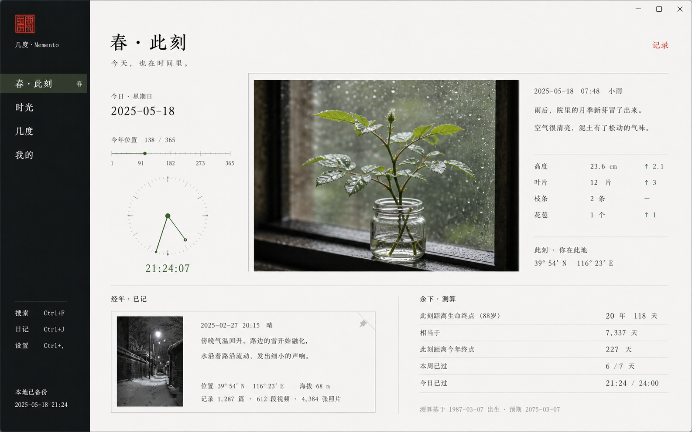

首屏结构：

- 页眉 88px。
- 主观察区高 460px，三列为 260px / 1fr / 250px，列间以 1px 线分隔。
- 左列：日期 48px、年度线 64px、时钟 210px、主时间 48px。
- 中列：照片比例约 4:3，最小宽 440px；下方 40px 图注。
- 右列：观察日期、2 行记录说明、最多 4 行量化元数据；不增加天气或坐标数据，除非产品未来真实支持。
- 下方高 210–230px：左 56% 为置顶记忆，右 44% 为经年／余下测量行。
- 记录为空时，下方仍保留同高结构，用教学文案替代，不让页面突然变矮。

关键感受：像一页仍在生长的观察档案，不像植物管理工具。

### 7.2 典藏 · 夏 · 时光

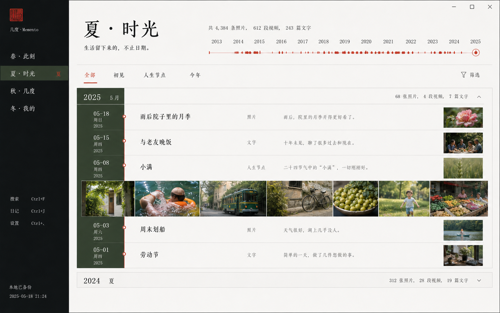

- 页眉与年份轴合计 126px。
- 筛选行 48px，选中项用朱红文字 + 2px 下划线。
- 月份组使用 150px 深叶色索引列 + 1fr 内容列。
- 舒适行高 78px；日期列 90px，标题列最小 250px，摘要列 1fr，缩略图 116×58px。
- 每 4–8 条记录可出现一条 132px 高接触印照片带，但照片带必须属于真实记录组。
- 时间轴当前位置用 1px 朱红线和 8px 圆点；禁止粗大装饰线。
- 500 条记录时只渲染视口附近内容，月份标题保持可定位。

### 7.3 典藏 · 秋 · 几度

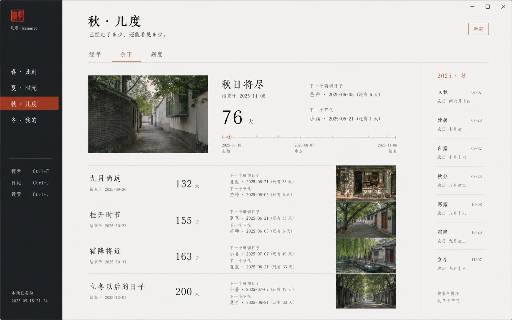

- 页眉 84px；三方向 Tab 56px。
- 当前「余下」主记录高 280px，左侧照片 30%、中间数据与基线 50%、右侧节气／日期索引 20%。
- 照片为可选；无照片时中间区扩展，不出现空白黑框。
- 主值 44px；终点日期和下一次日期均必须可见。
- 基线至少标出起点、当前、1 个中点和终点；屏幕窄时可只保留起点、当前、终点。
- 其余记录行高 94px，顺序为标题、终点、余下数量、下一个具体日期、操作。
- 图片中的节气栏只是构图参考；若当前数据模型没有节气数据，不实现节气功能。

### 7.4 典藏 · 冬 · 我的

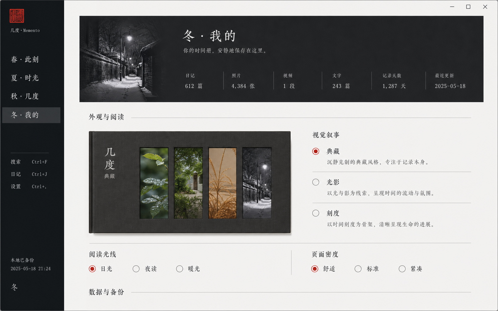

- 顶部身份区高 210–220px，使用深墨实底；照片最多占 28%，统计以分隔条出现，不做四张卡。
- 「外观与阅读」从首屏约 y=320 开始，确保无需长滚动即可找到。
- 视觉叙事区高 320–350px：左 64% 预览，右 36% 单选列表。
- 预览比例约 16:5，内部四季窄条相等；只能作为预览，不能点击四季单独配置。
- 单选项每项 72px，名称 16px，说明 12px，整行可点击。
- 下方阅读光线、密度、数字格式使用两列或三列标准字段。
- 数据与备份在下一节开始；危险操作与普通导出至少隔一个结构分区。

### 7.5 光影 · 春 · 此刻

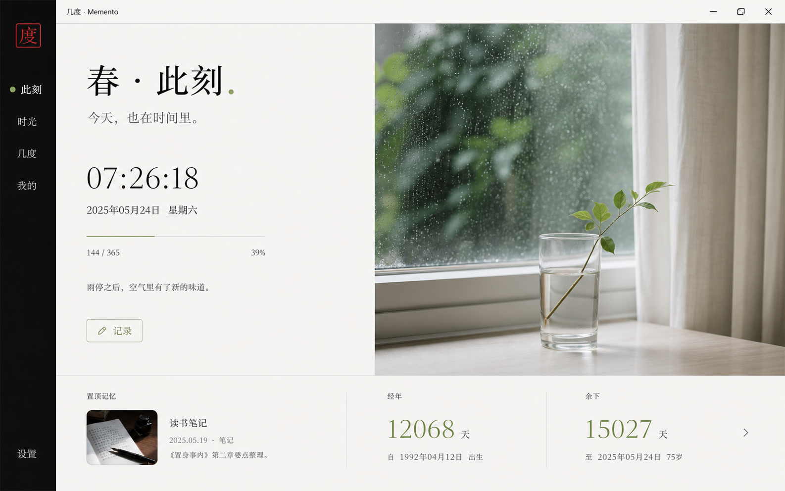

- 页眉并入主区域；主区域高 570–600px，左 35%、右 65%。
- 左侧至少 48px 内边距；标题 → 时间 → 日期 → 年度线 → 一句描述 → 记录动作。
- 右侧仅一张完整照片，不铺到导航下，不在图上叠正文。
- 底部摘要带高 150–170px，三列：置顶记忆 46%、经年 27%、余下 27%。
- 春色只占焦点、进度和照片内容，不给整张白底染绿。

### 7.6 光影 · 夏 · 时光

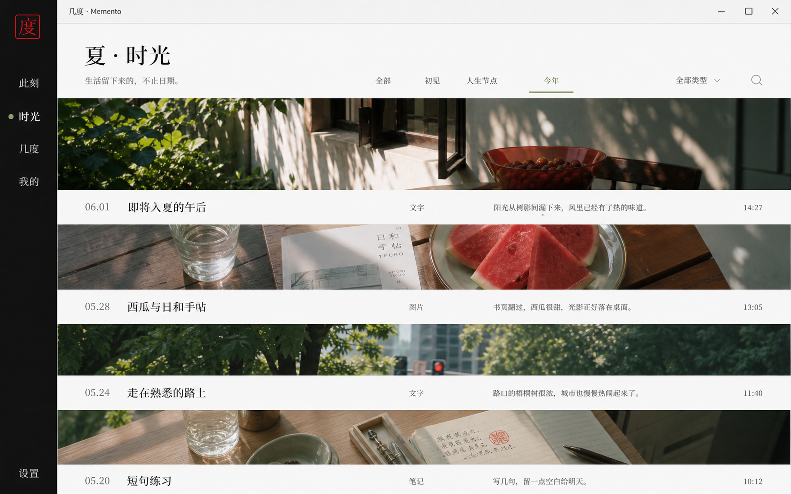

- 页眉 + 筛选共 148px。
- 记录以“照片带 150–190px + 信息行 64px”交替出现。
- 每条信息行固定显示日期、标题、类型、摘要、时间；照片不承载这些文字。
- 一屏最多可见 3 条完整照片带，防止变成图片瀑布流。
- 无照片记录使用中性实色带与文字摘录，占据相同信息行，不生成伪照片。
- 夏季浓度来自照片与深阴影；主内容背景仍保持中性。

### 7.7 光影 · 秋 · 几度

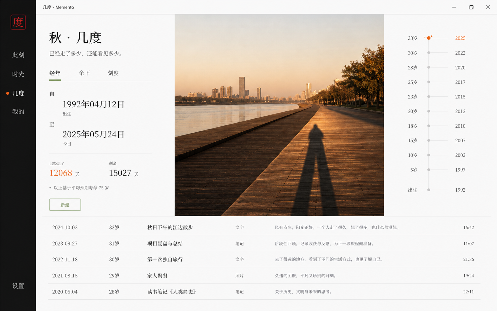

- 页眉 88px，Tab 48px。
- 主区高约 440px，三列 28% / 48% / 24%。
- 左列：开始日期、今天、已走、余下、解释。
- 中列：一张长影照片，裁切保持地平线与影子；无照片时改为实色时间场，不使用图库图替代用户内容。
- 右列：年龄／年份竖轴，当前点必须有文字标签；不把预期寿命描述成医学事实。
- 底部继续现有经年列表，标准行高 62–72px。
- 主题色只用于当前点和主值，不能把所有年份涂成橙色。

### 7.8 光影 · 冬 · 我的

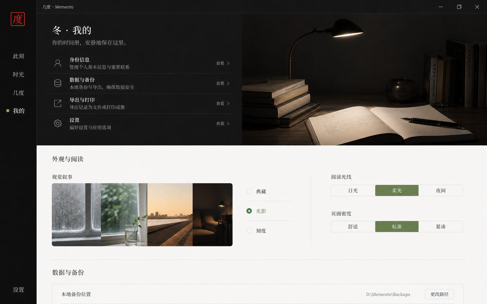

- 顶部高 270–300px：左 45% 为身份和设置入口，右 55% 为台灯／书桌照片。
- 照片不能延伸至外观设置与备份表单背景。
- 「外观与阅读」仍与典藏版相同：左预览、右三项单选，光影选中。
- 图片中“日光／柔光／夜间”等字样只是生成示意；真实控件必须使用现有“浅色／深色／高对比”。
- 冬季深色区域正文至少 4.5:1，次级说明不得低于 4.5:1。

### 7.9 刻度 · 春 · 此刻

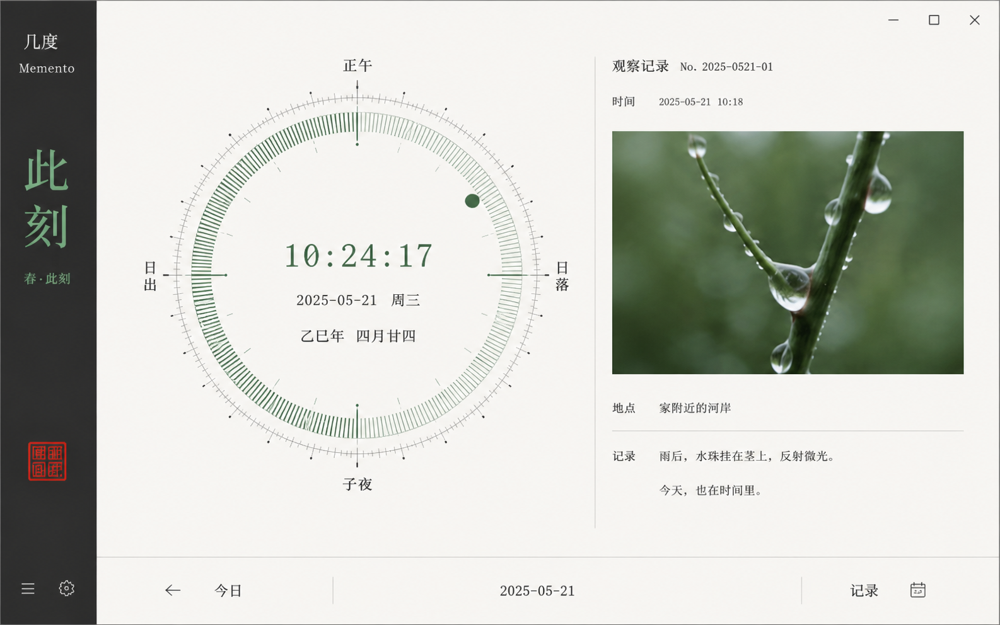

- 主区高 680–710px，左 62%、右 38%。
- 主表盘最大 520×520px；在 1280px 宽时降至 440px。
- 表盘只表达三层：当前时间、今日位置、年度位置。不能加入产品没有的数据。
- 刻度密度：外圈最多 60 个细刻度，12 个主刻度；年度层最多 12 个主节点。
- 右侧观察记录含照片、日期、标题与正文；不显示虚构天气、镜头型号或坐标。
- 底部工具条高 58px，提供今日、日期、记录和日历入口；快捷操作必须有文字。

### 7.10 刻度 · 夏 · 时光

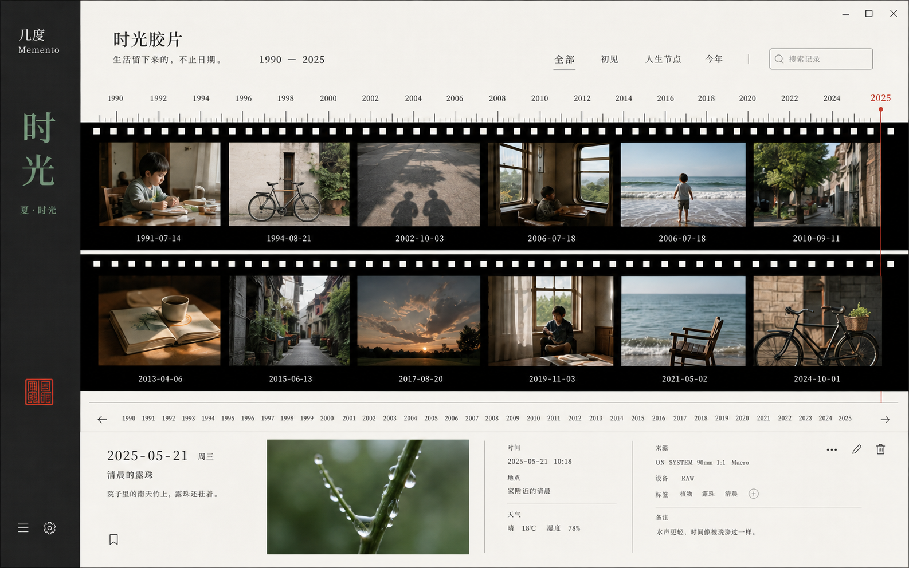

- 顶部索引 120–140px：标题、年份范围、筛选和搜索。
- 年份尺高 54px，默认只显示有数据的关键年份及均匀辅助刻度。
- 两条胶片带各高 188–210px，带间距 8px；每张照片下方必须有日期。
- 红色当前位置线贯穿胶片和年份尺，宽 1px。
- 下方详情区高 220px，显示选中记录，不弹 Modal。
- 无照片记录以带日期和标题的白色片格出现；胶片穿孔不应成为强烈复古装饰。

### 7.11 刻度 · 秋 · 几度

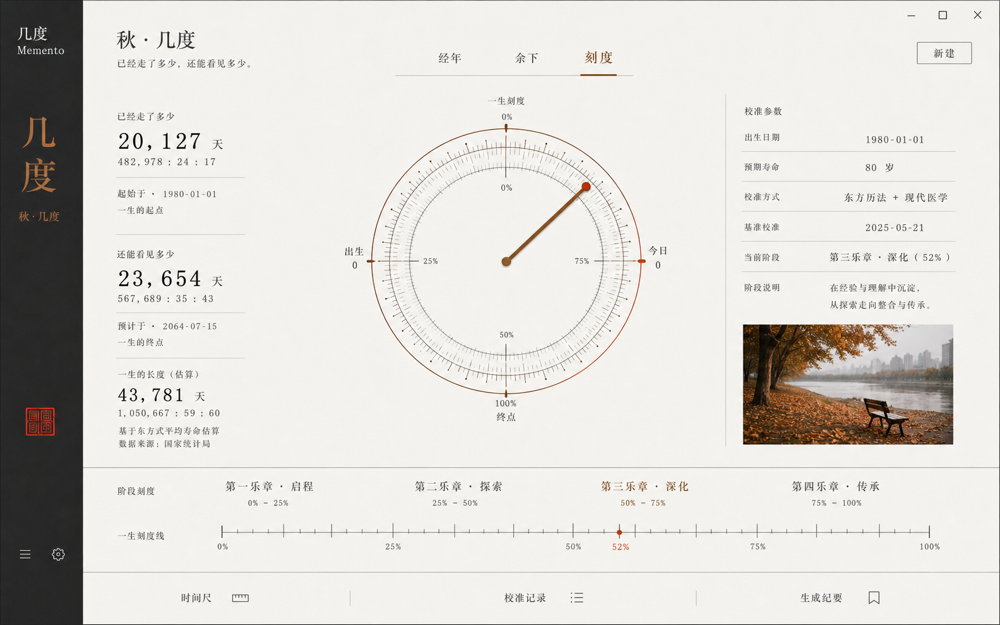

- 页眉 82px，Tab 48px。
- 主校准区高 500–530px，三列 24% / 50% / 26%。
- 左列显示已走、余下和估算总长，每项附起止日期和说明。
- 中间只允许一个主测量图，最大 440px；图形下必须有文本等价表达。
- 右列仅展示真实存在的出生日期、预期年限和当前阶段；图中“东方历法＋现代医学”等虚构校准方式不得实现。
- 底部阶段刻度使用单条线性进度，并继续显示可点击的标准阶段行。
- 不实时滚动秒数；仅当前时钟页可每秒更新。

### 7.12 刻度 · 冬 · 我的

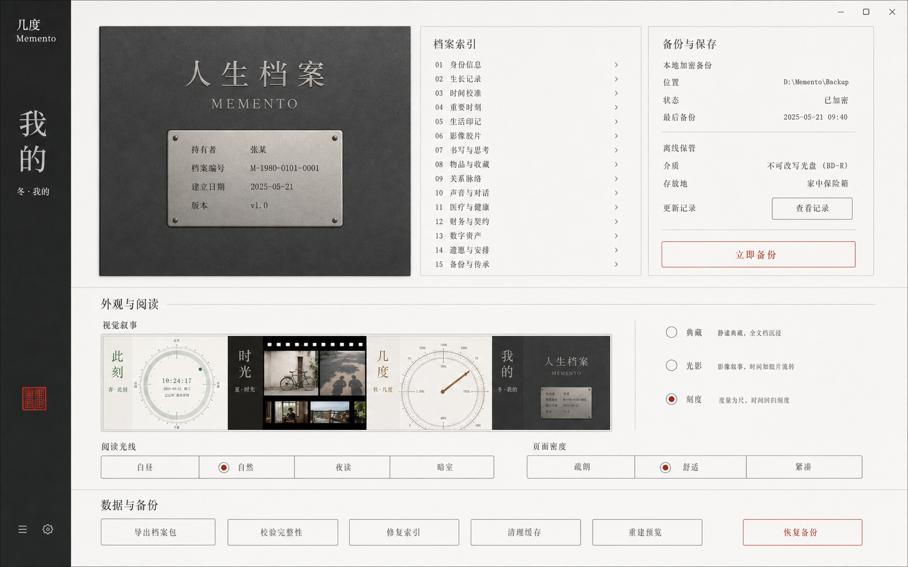

- 顶部可使用三列：档案身份 40%、设置索引 30%、备份摘要 30%，总高 310–330px。
- 身份封面为纯平面石墨表面和信息铭牌，不绘制锁、门、铰链。
- 设置索引只列出当前产品真实区块：个人／人生进度、外观与阅读、数据与备份、关于。
- 备份摘要只展示真实状态：本地、最近备份、加密说明、导出／导入／恢复动作。
- 图中光盘、校验、离线保管介质和大量分类目录均是生成内容，不得实现。
- 下方视觉叙事选择器结构与其他版本一致，刻度选中；再下方展示现有浅色、深色、高对比、密度与数字格式。

## 8. 视觉叙事切换器

### 8.1 数据含义

- 新字段：`visualNarrative`。
- 允许值：`archive`、`light`、`instrument`。
- 缺失、未知或旧备份导入时回退 `archive`。
- 不修改现有 `theme`、`displayDensity`、`numberFormat` 的含义。

### 8.2 交互细节

1. 页面初始显示已持久化值。
2. hover 或键盘 focus 只更新左侧临时预览。
3. click、Enter 或 Space 才正式应用并持久化。
4. 应用时保留当前页、滚动、筛选、几度子 Tab、抽屉和表单输入。
5. 切换成功不弹 Toast；选中状态和页面变化已经足够。
6. 保存失败时回滚到原值，在选择器下方就地显示错误，不影响记录数据。
7. 切换后焦点仍停留在被选择的选项。

### 8.3 预览规则

- 预览包含四条等宽季节缩略图，分别代表此刻、时光、几度、我的。
- 预览图不得展示用户私人照片的清晰内容；可使用内置样片或经过裁切的抽象化内容。
- 预览只表达视觉叙事，不允许点击其中的单个季节。
- 高对比模式下预览仍可有颜色，但真实页面遵循高对比覆盖规则。

## 9. 明暗、高对比和密度组合

### 9.1 浅色

- 以 `surface` 为主，深色面只用于导航、冬季身份区和必要的夏季照片带。
- 不用米色制造档案感；档案感来自编号、排版、细线和照片。

### 9.2 深色

- 不能简单反转照片或所有 token。
- 文本、表单、分隔和焦点分别使用深色专用 token。
- 光影主题的春夏照片仍保持自然色；不统一加暗绿滤镜。
- 典藏主题的纸面转为深墨表面，不模拟棕色旧纸。

### 9.3 高对比

- 黑底白字或白底黑字；主要动作与危险操作使用可辨识深红。
- 可隐藏大面积气氛照片，保留内容照片为带边框缩略图。
- 所有细线至少 1px 实色，关键边界 2px。
- 所有选择除颜色外必须有实心标记、下划线或文字状态。

### 9.4 紧凑密度

- 只压缩列表行、设置字段和垂直间距 15–22%。
- 不压缩触控／点击目标低于 32px，不缩小正文。
- 主照片、主时间图和页标题尺寸最多缩小 10%，不能让叙事失去识别度。

## 10. 动效

| 场景 | 时长 | 动画 | reduced motion |
| --- | ---: | --- | --- |
| 导航切页 | 160–200ms | 内容轻微淡入；不从远处滑入 | 立即出现 |
| 视觉叙事切换 | 180–220ms | 旧布局淡出 80ms，token 与布局替换，新布局淡入 | 立即替换 |
| Tab 切换 | 150–180ms | 下划线／位置块移动，内容交叉淡化 | 仅状态切换 |
| 行 hover | 120–150ms | 背景或 4px 内边距变化 | 保留颜色变化 |
| 照片加载 | 180ms | 实色占位到照片交叉淡化 | 立即显示 |
| Toast | 180ms | 淡入，停留足够阅读时间 | 立即显示 |

禁止：弹跳、弹簧、持续漂浮、装饰性粒子、每个区块依次入场、表盘无意义旋转。

## 11. 状态矩阵

| 状态 | 此刻 | 时光 | 几度 | 我的 |
| --- | --- | --- | --- | --- |
| 首次使用 | 解释记录入口，主时间仍可见 | 显示第一条记录会成为起点 | 分别教经年／余下／刻度如何建立 | 优先引导备份与外观选择 |
| 无照片 | 使用排版观察纸，不生成伪照片 | 记录行保持完整，缩略图区省略 | 相关列扩展，不留空框 | 预览使用内置样片，不读取网络 |
| 单条记录 | 作为置顶记忆 | 单独月份组，不夸张填满页面 | 正常主记录 + 无其余行 | 统计如实显示 1 |
| 大量记录 | 只加载置顶和摘要 | 虚拟化／延迟加载、月份定位 | 排序与筛选保持可用 | 统计不阻塞设置加载 |
| 图片损坏 | 同尺寸错误占位 + 打开详情 | 行仍可点击，显示重试 | 不影响数值 | 不影响备份操作 |
| 存储失败 | 记录动作就地报错 | 筛选仍可用 | 编辑不覆盖原数据 | 外观回滚，数据不受影响 |
| 导入进行中 | 保留页面但锁定冲突写操作 | 同左 | 同左 | 就地进度与取消策略 |
| 高对比 | 图像退居次要 | 时间轴边界增强 | 图形有文字等价 | 所有字段和危险操作清楚 |

## 12. 文案事实约束

- 不显示产品未收集的天气、海拔、经纬度、相机型号、健康推断或医学寿命结论。
- 人生预期年限必须明确来自用户主动输入，不写成系统预测。
- 不显示不存在的“校准方式”“不可改写光盘”“离线保管箱”等生成图内容。
- 所有示例日期和数值在实际界面中来自真实状态；不硬编码参考图里的 1992、2025、80 岁等数据。
- “春／夏／秋／冬”只作为页面身份出现一次，不写大量季节诗句。

## 13. 实现与验收截图

每种视觉叙事至少生成以下截图：

1. 1440×900：四个页面浅色／默认密度，共 4 张。
2. 1440×900：冬·我的的深色和高对比，共 2 张。
3. 1280×720：春·此刻和秋·几度，共 2 张。
4. 1920×1080：夏·时光，共 1 张。
5. 空数据与无照片状态至少各 1 张。

三套共至少 31 张验收截图。审阅时并排比较：

- 同一页面在三种叙事下功能位置是否仍然可预测。
- 同一叙事的四页是否一眼可辨春夏秋冬。
- 页面是否仍像记录产品，而不是摄影集、日历工具或仪表盘。
- 设置页切换器是否在三种叙事中保持固定位置与操作逻辑。

## 14. P0 / P1 失败条件

### P0

- 切换叙事导致记录、照片、设置或备份数据丢失。
- 旧备份无法导入或未知叙事值导致应用无法启动。
- 主题切换丢失未提交表单或错误执行危险操作。

### P1

- 任一叙事缺失四页中的一页或关键状态。
- 设置页在某套叙事下无法键盘操作或无法切回。
- 正文对比低于 4.5:1，焦点不可见，reduced motion 未处理。
- 1280px 出现横向溢出、按钮遮挡或标题裁切。
- 光影版变成图片瀑布流，刻度版变成 KPI 仪表盘，典藏版变成米黄旧纸模板。
- 三种叙事通过复制业务组件实现，造成状态与逻辑分叉。
